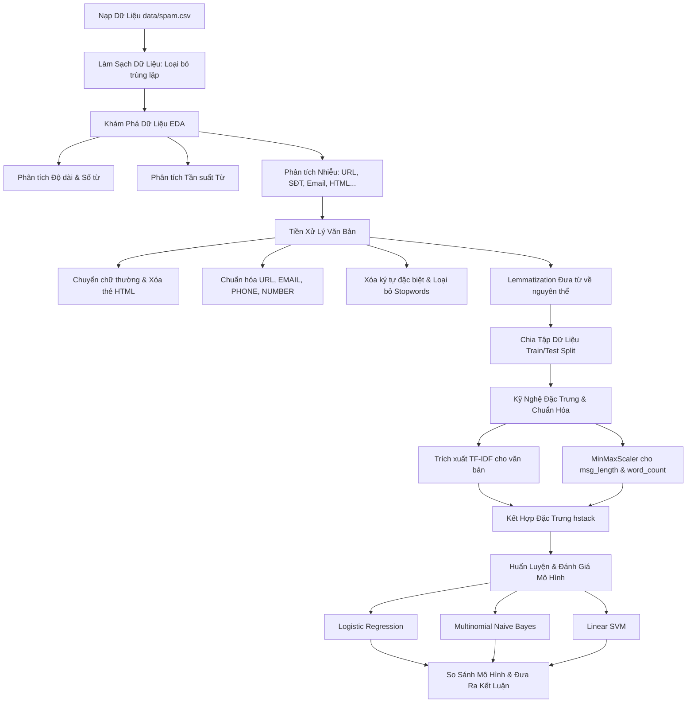

# HỆ THỐNG PHÂN LOẠI EMAIL SPAM BẰNG HỌC MÁY
## (Spam Email Classification System using Machine Learning)

Dự án này xây dựng một hệ thống học máy hoàn chỉnh nhằm phân loại email là **Spam** (Thư rác) hoặc **Ham** (Thư thường) dựa trên nội dung văn bản và các đặc trưng cấu trúc/độ dài của email. Toàn bộ quy trình từ khám phá dữ liệu, làm sạch, tiền xử lý văn bản, kỹ nghệ đặc trưng cho đến huấn luyện và so sánh mô hình được thực hiện và trình bày chi tiết trong file notebook `index.ipynb`.

> [!IMPORTANT]
> **TÀI LIỆU HỖ TRỢ THUYẾT TRÌNH & LÀM SLIDE CHUYÊN NGHIỆP:**
> Nhằm giúp bạn thuyết trình và báo cáo dự án một cách tốt nhất trước hội đồng hoặc lớp học, chúng tôi đã biên soạn một **Báo Cáo Dự Án & Kịch Bản Thuyết Trình Slide-by-Slide** chi tiết. 
> 
> 👉 **Xem ngay tại đây:** [REPORT_PRESENTATION.md](file:///d:/projects/spam-email-classification/REPORT_PRESENTATION.md)
> 
> Báo cáo bao gồm:
> * Sườn thiết kế 14 slide thuyết trình cực kỳ khoa học.
> * Nội dung tóm tắt cho từng slide (Slide Content).
> * **Kịch bản nói chi tiết (Speaker Notes)** bằng tiếng Việt, giải thích cặn kẽ các khái niệm khó như **TF-IDF**, **MinMaxScaler**, **hstack** và phân tích tại sao hiệu năng mô hình thay đổi sau khi kết hợp đặc trưng độ dài.

---

## 1. Kiến Trúc & Quy Trình Hệ Thống (Pipeline Overview)

Dưới đây là sơ đồ luồng hoạt động từ đầu đến cuối của dự án:



---

## 2. Chi Tiết Các Bước Triển Khai trong Notebook

### Bước 1: Khám Phá & Làm Sạch Dữ Liệu (Data Exploration & Cleaning)
* **Tải dữ liệu:** Nạp file `data/spam.csv` với 5.572 dòng dữ liệu ban đầu.
* **Xử lý trùng lặp:** Phát hiện và loại bỏ **415 dòng trùng lặp**, đưa kích thước tập dữ liệu thực tế về **5.157 dòng** (4.516 Ham - 87.6% và 641 Spam - 12.4%). Sự mất cân bằng class này được xử lý bằng cách sử dụng tham số `stratify` khi chia dữ liệu và `class_weight='balanced'` trong mô hình.

### Bước 2: Phân Tích Đặc Trưng Độ Dài & Nhiễu (EDA & Noise Analysis)
* **Độ dài & Số từ:**
  * **Ham:** Độ dài trung bình là **70.9 ký tự** (~14.2 từ).
  * **Spam:** Độ dài trung bình là **137.1 ký tự** (~23.7 từ). Email spam có xu hướng dài hơn rõ rệt và độ lệch chuẩn nhỏ (độ dài rất tập trung).
* **Phân tích Nhiễu (Noise Analysis):** Thống kê sự xuất hiện của các yếu tố đặc biệt:
  * **Thẻ HTML:** 100% xuất hiện trong Spam (6 mẫu).
  * **URLs:** 87 mẫu trong Spam vs chỉ 1 mẫu trong Ham.
  * **Email/Số điện thoại:** Xuất hiện áp đảo trong tập Spam (346 số điện thoại trong Spam vs 1 trong Ham).
  * **Ký tự đặc biệt ($, !, #, *):** Xuất hiện dày đặc trong email Spam để thu hút sự chú ý.

### Bước 3: Tiền Xử Lý Văn Bản (Text Preprocessing)
Xây dựng hàm `preprocess_text` xử lý triệt để nội dung email theo các bước tuần tự:
1. **Lowercasing:** Chuyển toàn bộ văn bản về chữ thường.
2. **HTML Stripping:** Loại bỏ các thẻ HTML bằng `BeautifulSoup`.
3. **URL Normalization:** Thay thế toàn bộ liên kết web bằng token `" URL "`.
4. **Email Normalization:** Thay thế hòm thư điện tử bằng token `" EMAIL "`.
5. **Phone Normalization:** Thay thế số điện thoại bằng token `" PHONE "`.
6. **Number Normalization:** Thay thế các số thông thường bằng token `" NUMBER "`.
7. **Punctuation & Special Characters Removal:** Xóa bỏ toàn bộ các ký tự đặc biệt không phải chữ và số.
8. **Stopwords Removal:** Loại bỏ các từ dừng tiếng Anh phổ biến (NLTK stopwords).
9. **Lemmatization:** Sử dụng `WordNetLemmatizer` của NLTK để đưa các từ về dạng nguyên thể (ví dụ: *running*, *ran* -> *run*).

### Bước 4: Chia Dữ Liệu Train/Test (Split Dataset)
Chia dữ liệu theo tỷ lệ **80% huấn luyện (Train)** và **20% đánh giá (Test)**. Sử dụng thuộc tính phân tầng `stratify=y` để đảm bảo tỷ lệ class Ham/Spam cân bằng đồng đều ở cả hai tập:
```python
X = data[['processed_message', 'msg_length', 'word_count']]
y = data['Category']
X_train, X_test, y_train, y_test = train_test_split(X, y, test_size=0.2, random_state=42, stratify=y)
```

### Bước 5: Trích Xuất & Chuẩn Hóa Đặc Trưng (Feature Extraction & Scaling)
* **Đặc trưng Văn bản (TF-IDF):** Chuyển đổi văn bản đã tiền xử lý thành ma trận số học sử dụng `TfidfVectorizer` với tối đa 5000 từ khóa, bao gồm cả từ đơn và từ ghép đôi (unigrams & bigrams).
* **Đặc trưng Độ dài (MinMaxScaler):** Chuẩn hóa `msg_length` và `word_count` về khoảng `[0, 1]` bằng `MinMaxScaler`. Điều này giữ các đặc trưng số không âm và cùng thang đo với TF-IDF, giúp mô hình hội tụ nhanh và hoạt động chính xác.
* **Kết hợp đặc trưng (Feature Fusion):** Sử dụng `hstack` để kết hợp các đặc trưng thưa (sparse) và đặc trưng số học dày đặc (dense).

### Bước 6: Huấn Luyện & Đánh Giá Mô Hình (Model Training & Evaluation)
Hệ thống thử nghiệm và đánh giá ba thuật toán phổ biến trong phân loại văn bản:
1. **Logistic Regression (Hồi quy Logistic):** Cấu hình với `class_weight='balanced'` để xử lý dữ liệu lệch class.
2. **Multinomial Naive Bayes (Bayes ngây thơ):** Mô hình xác suất dựa trên tần suất xuất hiện từ.
3. **Linear SVM (LinearSVC - Máy vectơ hỗ trợ):** Mô hình tìm siêu phẳng phân tách tối ưu.

---

## 3. Bảng So Sánh Hiệu Năng & Phân Tích Kỹ Thuật

Dưới đây là kết quả kiểm thử F1-Score của các mô hình trước và sau khi bổ sung các đặc trưng độ dài (`msg_length` & `word_count`):

| Mô Hình | Trước cải tiến (Chỉ dùng TF-IDF) | Sau cải tiến (TF-IDF + Length) | Thay đổi F1-score |
| :--- | :---: | :---: | :---: |
| **Logistic Regression** | 90.15% | **90.42%** | **+0.27%** (Tăng trưởng) |
| **Multinomial Naive Bayes** | **89.66%** | 89.18% | **-0.48%** (Giảm nhẹ) |
| **Linear SVM** | **93.88%** | 93.55% | **-0.33%** (Giảm nhẹ) |

### Phân Tích Chuyên Sâu:
1. **Logistic Regression (+0.27%):** Đạt mức tăng trưởng F1-score rõ rệt. Do là mô hình tuyến tính, Logistic Regression học được các trọng số thực phân biệt rất tốt từ độ dài email (Spam dài hơn Ham một cách có hệ thống), tạo ra tín hiệu bổ trợ giá trị bên cạnh từ khóa TF-IDF.
2. **Multinomial Naive Bayes (-0.48%):** Naive Bayes giả định các đặc trưng độc lập tuyệt đối khi biết nhãn. Các đặc trưng độ dài và số lượng từ vi phạm nghiêm trọng giả định này vì chúng có tương quan cực kỳ cao với số lượng từ khóa trong TF-IDF. Ngoài ra, việc đưa biến liên tục (dù đã MinMaxScaler) vào mô hình xác suất vốn tối ưu cho đếm tần suất rời rạc làm giảm nhẹ độ chính xác của Naive Bayes.
3. **Linear SVM (-0.33%):** Ranh giới phân tách siêu phẳng 5000 chiều của TF-IDF thuần túy vốn đã đạt trạng thái tối ưu cực cao (93.88%). Việc chèn thêm 2 chiều đặc trưng độ dài số học làm xoay nhẹ siêu phẳng phân tách này theo hướng phụ thuộc độ dài, dẫn đến giảm nhẹ khả năng tổng quát hóa đối với một vài mẫu email Spam ngắn hoặc Ham dài cá biệt.

---

## 4. Hướng Dẫn Cài Đặt & Chạy Dự Án

### Các thư viện yêu cầu:
Để chạy notebook này, bạn cần cài đặt các thư viện Python sau:
```bash
pip install pandas numpy matplotlib seaborn scikit-learn beautifulsoup4 nltk
```

### Các bước thực thi:
1. Đảm bảo file dataset gốc nằm đúng đường dẫn `./data/spam.csv`.
2. Mở file `index.ipynb` trên VS Code hoặc Jupyter Notebook.
3. Nhấp **Run All** để thực thi toàn bộ pipeline. Kết quả thống kê và các biểu đồ so sánh phân phối sẽ được hiển thị trực tiếp.
