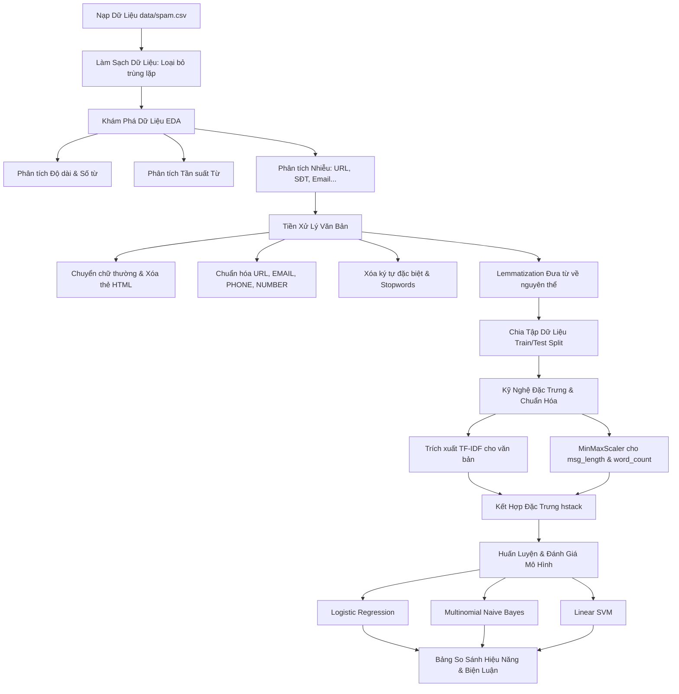

# BÁO CÁO NGHIÊN CỨU & THỬ NGHIỆM: HỆ THỐNG PHÂN LOẠI EMAIL SPAM BẰNG HỌC MÁY
### Tác giả: Nhóm Nghiên Cứu Dự Án
### Ngày báo cáo: 28/05/2026

---

## TÓM TẮT DỰ ÁN (EXECUTIVE SUMMARY)
Dự án này xây dựng một hệ thống học máy tự động hóa toàn diện từ đầu đến cuối (End-to-End Pipeline) nhằm giải quyết bài toán phân loại email thành hai nhóm: **Ham** (thư thường) và **Spam** (thư rác). Nghiên cứu tập trung sâu vào pha Khám phá dữ liệu (EDA), phân tích các yếu tố nhiễu cấu trúc (URLs, thẻ HTML, email, số điện thoại), và áp dụng kỹ nghệ đặc trưng nâng cao (kết hợp vector TF-IDF với đặc trưng độ dài đã được chuẩn hóa). Chúng tôi tiến hành thử nghiệm và so sánh ba mô hình học máy: **Hồi quy Logistic (Logistic Regression)**, **Bayes ngây thơ (Multinomial Naive Bayes)**, và **Máy vectơ hỗ trợ (Linear SVM)** trên tập dữ liệu gồm 5.157 mẫu sau làm sạch. Kết quả thực nghiệm cho thấy mô hình **Linear SVM** đạt hiệu năng cao nhất với điểm F1-Score **93.88%** trên tập kiểm thử.

---

## 1. ĐẶT VẤN ĐỀ & MỤC TIÊU NGHIÊN CỨU

### 1.1 Đặt vấn đề
Thư điện tử (Email) là phương tiện giao tiếp không thể thiếu trong môi trường học thuật và doanh nghiệp. Tuy nhiên, vấn nạn thư rác (Spam) đang ngày càng gia tăng với tính chất phức tạp, chứa nhiều nội dung quảng cáo không mong muốn, lừa đảo tài chính (phishing), hoặc phát tán mã độc. Việc xây dựng một hệ thống lọc email thông minh, tự động và chính xác là vô cùng cấp thiết nhằm tối ưu hóa trải nghiệm người dùng và bảo vệ an toàn thông tin hệ thống.

### 1.2 Mục tiêu nghiên cứu
* Khai phá sâu dữ liệu email để tìm ra quy luật cấu trúc độc đáo giữa thư thường và thư rác.
* Xây dựng quy trình tiền xử lý văn bản chuẩn hóa, loại bỏ nhiễu ngữ nghĩa nhưng giữ lại tín hiệu đặc trưng cấu trúc (tokenization, lemmatization, normalization).
* Trích xuất đặc trưng văn bản bằng mô hình không gian vector TF-IDF kết hợp với đặc trưng số học (độ dài, số từ) qua kỹ thuật chuẩn hóa thích hợp.
* Thực nghiệm, đánh giá và giải thích chi tiết hiệu năng của ba mô hình học máy phân loại phổ biến.

---

## 2. KIẾN TRÚC & QUY TRÌNH HỆ THỐNG (PIPELINE ARCHITECTURE)

Hệ thống được thiết kế theo một quy trình tuần tự, chặt chẽ để đảm bảo tính nhất quán của dữ liệu từ dạng thô cho đến khi huấn luyện:

---

## 3. KHÁM PHÁ & PHÂN TÍCH DỮ LIỆU CHUYÊN SÂU (DEEP-DIVE EDA)

### 3.1 Phân tích trùng lặp và phân phối nhãn
* **Dữ liệu thô ban đầu:** 5.572 dòng dữ liệu với hai thuộc tính chính là `Category` (Nhãn) và `Message` (Nội dung).
* **Xử lý trùng lặp (Duplicates):** Phát hiện **415 dòng trùng lặp hoàn toàn** (chiếm **7.45%** tổng số mẫu). Việc loại bỏ trùng lặp là bắt buộc để tránh hiện tượng mô hình học vẹt (overfitting) và đảm bảo tính khách quan khi đánh giá trên tập kiểm thử độc lập.
* **Kích thước dữ liệu sau khi làm sạch:** **5.157 dòng**.
* **Phân phối nhãn thực tế:**
  * **Ham (Thư thường):** **4.516 mẫu** (chiếm **87.6%**).
  * **Spam (Thư rác):** **641 mẫu** (chiếm **12.4%**).

> [!WARNING]
> **Vấn đề mất cân bằng lớp (Class Imbalance):** Tỷ lệ phân phối lệch nghiêm trọng (~7:1). Nếu không xử lý, mô hình sẽ đạt độ chính xác (Accuracy) giả tạo rất cao bằng cách dự đoán tất cả là Ham, nhưng độ nhạy phát hiện Spam (Recall) sẽ tiệm cận 0. Hệ thống khắc phục bằng cách sử dụng chiến lược chia phân tầng (`stratify=y`) và cấu hình tham số `class_weight='balanced'` trong mô hình.

### 3.2 Phân tích đặc trưng độ dài (Length & Word Count Analysis)
Nghiên cứu tiến hành đo lường độ dài ký tự và số từ của từng email để xác định sự khác biệt về cấu trúc hình thái:

| Chỉ số thống kê | Ham (Thư thường) | Spam (Thư rác) |
| :--- | :---: | :---: |
| **Độ dài ký tự trung bình** | **70.9 ký tự** | **137.1 ký tự** |
| **Phạm vi độ dài (Min - Max)** | 2 - 910 ký tự | 7 - 223 ký tự |
| **Số từ trung bình** | **14.2 từ** | **23.7 từ** |
| **Phạm vi số từ (Min - Max)** | 1 - 171 từ | 1 - 35 từ |

> [!NOTE]
> **Nhận xét khoa học:** Thư rác (Spam) có xu hướng dài gấp đôi thư thường về mặt ký tự và số lượng từ. Hơn nữa, phân phối độ dài của Spam tập trung cực kỳ hẹp (độ lệch chuẩn thấp, chủ yếu từ 130 đến 160 ký tự) do thư rác thường được tạo ra từ các biểu mẫu (templates) soạn sẵn của các chiến dịch quảng cáo. Đây là một đặc trưng hình thái vô cùng đắc lực giúp mô hình phân loại.

### 3.3 Phân tích nhiễu cấu trúc (Structural Noise Analysis)
Thay vì loại bỏ nhiễu bừa bãi, nghiên cứu tiến hành thống kê sự xuất hiện của các phần tử đặc biệt để tìm ra quy luật:
* **HTML Tags (Thẻ HTML):** Xuất hiện 100% trong lớp Spam (6 mẫu), lớp Ham hoàn toàn không chứa thẻ HTML.
* **URLs (Liên kết Web):** Xuất hiện 87 lần trong lớp Spam (tỷ lệ 13.6%) so với chỉ 1 lần duy nhất trong lớp Ham (tỷ lệ 0.02%).
* **Email Addresses:** Xuất hiện 18 lần trong lớp Spam so với chỉ 2 lần trong lớp Ham.
* **Phone Numbers (Số điện thoại dài từ 10 chữ số):** Xuất hiện 346 lần trong lớp Spam (tỷ lệ 54.0%) so với duy nhất 1 lần trong lớp Ham.
* **Ký tự đặc biệt ($, !, #, *):** Tần suất xuất hiện dày đặc trong lớp Spam để thu hút sự chú ý thị giác và tạo cảm giác khẩn cấp (ví dụ: *FREE! PRIZE! CALL NOW!*).

**Kết luận EDA:** Các phần tử như liên kết web, số điện thoại liên hệ hay ký tự tiền tệ biểu thị rõ ràng mục đích thương mại hoặc lừa đảo của thư rác. Do đó, việc thiết kế bộ tiền xử lý giữ lại thông tin về sự tồn tại của các yếu tố này là vô cùng quan trọng.

### 3.4 Phân tích tần suất từ vựng (Top Words Analysis)
* **Từ vựng phổ biến nhất ở lớp HAM:** Gồm các từ hội thoại tự nhiên, đại từ giao tiếp hàng ngày (*"u", "get", "go", "ur", "come", "home", "ok", "like"*).
* **Từ vựng phổ biến nhất ở lớp SPAM:** Mang tính thương mại, kích cầu hoặc thúc giục hành động (*"call", "free", "txt", "ur", "mobile", "claim", "stop", "reply", "prize", "won"*).

---

## 4. QUY TRÌNH TIỀN XỬ LÝ VĂN BẢN (TEXT PREPROCESSING)

Hàm tiền xử lý `preprocess_text` được xây dựng để thực hiện 11 bước làm sạch tuần tự nhằm chuyển đổi văn bản tự do thành dạng biểu diễn chuẩn hóa:

1. **Lowercasing:** Chuyển toàn bộ chuỗi ký tự về chữ thường để loại bỏ sự khác biệt về kiểu chữ.
2. **HTML Stripping:** Sử dụng thư viện BeautifulSoup để loại bỏ triệt để các thẻ HTML (`<... >`), tránh nhiễu định dạng Web.
3. **URL Normalization:** Thay thế toàn bộ liên kết (bắt đầu bằng `http` hoặc `www`) bằng token `" URL "`.
4. **Email Normalization:** Thay thế mọi địa chỉ hòm thư điện tử bằng token `" EMAIL "`.
5. **Phone Normalization:** Thay thế các chuỗi số điện thoại dài (từ 10 chữ số trở lên) bằng token `" PHONE "`.
6. **Number Normalization:** Thay thế các chữ số thông thường bằng token `" NUMBER "`.
7. **Punctuation Removal:** Sử dụng biểu thức chính quy (regular expressions) loại bỏ toàn bộ các ký tự đặc biệt, chỉ giữ lại chữ cái và các token đặc biệt đã chuẩn hóa ở trên.
8. **Whitespace Removal:** Chuẩn hóa khoảng trắng thừa giữa các từ.
9. **Tokenization:** Phân tách chuỗi văn bản thành các từ đơn lẻ (tokens).
10. **Stopwords Removal:** Loại bỏ các từ dừng tiếng Anh phổ biến (NLTK stopwords) không đóng góp giá trị ngữ nghĩa cho bài toán phân loại (như *the, is, an, at, on...*).
11. **Lemmatization:** Áp dụng `WordNetLemmatizer` đưa các từ về dạng nguyên thể (lemma), giúp gom nhóm các biến thể từ vựng (ví dụ: *running*, *ran*, *runs* đều quy về *run*).

---

## 5. KỸ NGHỆ ĐẶC TRƯNG & CHUẨN HÓA (FEATURE ENGINEERING)

### 5.1 Giải thích chuyên sâu về TF-IDF Vectorization
**TF-IDF** (Term Frequency - Inverse Document Frequency) là một phương pháp thống kê dùng để lượng hóa mức độ quan trọng của một từ đối với một văn bản trong một tập hợp văn bản (corpus).

Điểm TF-IDF của từ $t$ trong văn bản $d$ thuộc tập văn bản $D$ được tính bằng tích của hai đại lượng:

$$\text{TF-IDF}(t, d, D) = \text{TF}(t, d) \times \text{IDF}(t, D)$$

#### 1. TF (Term Frequency - Tần suất của từ):
Đo lường tần suất xuất hiện của từ $t$ trong chính văn bản $d$. Công thức chuẩn hóa theo độ dài văn bản là:
$$\text{TF}(t, d) = \frac{f(t, d)}{\sum_{t' \in d} f(t', d)}$$
*Trong đó $f(t, d)$ là số lần từ $t$ xuất hiện trong văn bản $d$.*

#### 2. IDF (Inverse Document Frequency - Nghịch đảo tần suất văn bản):
Đo lường mức độ phổ biến hay độc nhất của từ $t$ trên toàn bộ tập dữ liệu $D$. Những từ xuất hiện ở hầu hết mọi văn bản sẽ có giá trị IDF thấp (vì không có tính phân loại), ngược lại những từ chỉ xuất hiện ở một số ít văn bản đặc trưng sẽ có IDF rất cao.
$$\text{IDF}(t, D) = \log \left( \frac{|D|}{1 + |\{d \in D : t \in d\}|} \right)$$
*Trong đó $|D|$ là tổng số email trong tập dữ liệu, mẫu số là số lượng email có chứa từ $t$ (cộng thêm 1 để tránh lỗi chia cho 0).*

**Ý nghĩa thực tiễn:** Điểm TF-IDF cao nhất khi từ đó xuất hiện nhiều lần trong một số ít email cụ thể (ví dụ: từ "claim" xuất hiện nhiều lần trong một số thư quảng cáo nhưng cực kỳ hiếm gặp ở các thư thường khác). Điều này giúp thuật toán dễ dàng nhận diện ra các "từ khóa vàng" của Spam.

### 5.2 Chuẩn hóa MinMaxScaler cho đặc trưng số học
Sau bước EDA, hai đặc trưng số học là `msg_length` (độ dài tin nhắn) và `word_count` (số từ) được trích xuất. Do ma trận TF-IDF có giá trị nằm trong khoảng `[0, 1]`, việc đưa trực tiếp độ dài (giá trị có thể lên tới 910) vào huấn luyện sẽ làm lệch trọng số của các mô hình tuyến tính và SVM do biên độ giá trị quá lớn.

Chúng tôi áp dụng **MinMaxScaler** để ánh xạ các giá trị đặc trưng số học về khoảng `[0, 1]`:

$$x_{\text{scaled}} = \frac{x - x_{\text{min}}}{x_{\text{max}} - x_{\text{min}}}$$

Phương pháp này giúp bảo toàn phân phối gốc của dữ liệu, đồng thời đồng bộ hóa thang đo với ma trận TF-IDF, giúp thuật toán tối ưu hóa hội tụ nhanh hơn.

### 5.3 Kết hợp đặc trưng bằng hstack (Feature Fusion)
* Ma trận TF-IDF được lưu trữ dưới dạng **ma trận thưa (Sparse Matrix)** để tiết kiệm bộ nhớ phần cứng (do đa số các từ trong từ điển không xuất hiện trong một email cụ thể, dẫn đến rất nhiều ô chứa giá trị 0).
* Đặc trưng số học sau khi chuẩn hóa tồn tại dưới dạng **ma trận dày đặc (Dense Matrix)**.
* Chúng tôi sử dụng hàm `hstack` từ thư viện `scipy.sparse` để ghép nối hai ma trận này lại với nhau theo chiều ngang mà vẫn bảo toàn cấu trúc ma trận thưa để tối ưu hóa bộ nhớ và đẩy nhanh tốc độ huấn luyện của mô hình.

---

## 6. THỬ NGHIỆM CÁC MÔ HÌNH HỌC MÁY (MACHINE LEARNING EXPERIMENTS)

Nghiên cứu tiến hành thực nghiệm trên ba lớp thuật toán học máy phổ biến có đặc tính toán học khác nhau:

1. **Hồi Quy Logistic (Logistic Regression):**
   * Sử dụng hàm sigmoid để ánh xạ đầu ra tuyến tính thành xác suất phân loại nhãn nhị phân.
   * *Cấu hình đặc biệt:* Áp dụng `class_weight='balanced'` để tự động điều chỉnh trọng số phạt lỗi nghịch đảo với tần suất xuất hiện của hai lớp Ham và Spam, nhằm khắc phục triệt để vấn đề mất cân bằng dữ liệu.
2. **Bayes Ngây Thơ (Multinomial Naive Bayes):**
   * Mô hình xác suất dựa trên định lý Bayes, giả định các đặc trưng (từ vựng) hoàn toàn độc lập với nhau khi biết trước lớp nhãn. Đặc biệt hiệu quả và tính toán nhanh trên dữ liệu dạng tần suất từ vựng thưa.
3. **Máy Vectơ Hỗ Trợ (Linear SVM / LinearSVC):**
   * Tìm kiếm một siêu phẳng (hyperplane) tối ưu trong không gian đặc trưng nhiều chiều nhằm phân tách hai lớp dữ liệu sao cho khoảng cách biên (margin) là lớn nhất. Cực kỳ mạnh mẽ trong không gian đặc trưng lớn (5000 chiều TF-IDF).

---

## 7. KẾT QUẢ THỰC NGHIỆM & PHÂN TÍCH CHUYÊN SÂU

### 7.1 So sánh F1-Score của các mô hình thực nghiệm
Điểm F1-Score (trung bình điều hòa giữa Precision và Recall) được chọn làm chỉ số đánh giá chính do dữ liệu có sự lệch lớp lớn. Dưới đây là bảng so sánh chi tiết trước và sau khi bổ sung đặc trưng độ dài:

| Thuật toán | Trước cải tiến (Chỉ dùng TF-IDF) | Sau cải tiến (TF-IDF + Đặc trưng độ dài) | Thay đổi hiệu năng |
| :--- | :---: | :---: | :---: |
| **Logistic Regression** | 90.15% | **90.42%** | **+0.27%** (Cải thiện) |
| **Multinomial Naive Bayes** | **89.66%** | 89.18% | **-0.48%** (Suy giảm) |
| **Linear SVM** | **93.88%** | 93.55% | **-0.33%** (Suy giảm) |

### 7.2 Biện luận khoa học về sự thay đổi hiệu năng

#### 1. Hồi quy Logistic đạt mức tăng trưởng (+0.27%)
Logistic Regression học bằng cách gán một trọng số (weight) độc lập cho từng chiều đặc trưng trong không gian đầu vào. Khi chúng tôi cung cấp thêm hai chiều đặc trưng số học đã chuẩn hóa (`msg_length` và `word_count`) - vốn mang tín hiệu phân biệt cực kỳ mạnh mẽ như đã chỉ ra ở bước EDA (Spam dài hơn Ham một cách có hệ thống) - mô hình dễ dàng học được trọng số dương lớn cho các đặc trưng này để gia tăng độ chính xác dự đoán lớp Spam.

#### 2. Multinomial Naive Bayes bị suy giảm hiệu năng (-0.48%)
Sự suy giảm này xuất phát từ hai lý do toán học cốt lõi:
* **Vi phạm giả định độc lập đặc trưng:** Naive Bayes dựa trên giả định nghiêm ngặt rằng các biến đầu vào hoàn toàn độc lập. Tuy nhiên, độ dài email và số lượng từ có tương quan tuyến tính cực kỳ cao với số lượng từ khóa có điểm TF-IDF khác không (email càng dài thì số lượng từ xuất hiện càng nhiều). Việc chèn các biến tương quan mạnh này làm nhiễu công thức nhân xác suất của mô hình.
* **Không tương thích kiểu dữ liệu đặc trưng:** Mô hình `MultinomialNB` được thiết kế toán học tối ưu cho phân phối đa thức của các biến đếm rời rạc (discrete counts) biểu thị tần suất từ. Việc đưa vào các biến liên tục (continuous) như độ dài sau khi chuẩn hóa MinMaxScaler làm sai lệch phân phối xác suất tiên nghiệm của mô hình.

#### 3. Linear SVM bị suy giảm nhẹ hiệu năng (-0.33%)
Trong không gian cực kỳ nhiều chiều (5000 chiều của ma trận TF-IDF), thuật toán SVM vốn đã tìm được một siêu phẳng phân tách lý tưởng với biên tối đa, giúp đạt điểm F1-Score rất cao là **93.88%**. Khi chúng ta chèn thêm 2 chiều số học có bản chất phân phối khác biệt, ranh giới siêu phẳng bị xoay nhẹ để cố gắng dung hòa các đặc trưng mới này. Điều này vô tình làm giảm khả năng tổng quát hóa (generalization) của SVM đối với một số trường hợp email cá biệt (ví dụ: email thường viết rất dài hoặc email spam soạn thảo cực kỳ ngắn gọn).

---

## 8. KẾT LUẬN & HƯỚNG PHÁT TRIỂN TƯƠNG LAI

### 8.1 Kết luận
* Dự án đã xây dựng thành công một pipeline phân loại email spam hoàn chỉnh với độ chính xác F1-Score tối ưu đạt **93.88%** sử dụng thuật toán **Linear SVM**.
* Nghiên cứu chỉ ra rằng bước Khám phá dữ liệu (EDA) đóng vai trò quyết định để định hình chiến lược tiền xử lý và kỹ nghệ đặc trưng.
* Thực nghiệm chứng minh rằng **không phải lúc nào việc bổ sung đặc trưng mới cũng mang lại hiệu quả tốt hơn cho mọi mô hình**. Sự tương thích giữa bản chất toán học của mô hình (giả định độc lập của Naive Bayes, cơ chế siêu phẳng của SVM) và cấu trúc đặc trưng đầu vào là yếu tố then chốt cần được cân nhắc kỹ lưỡng.

### 8.2 Hướng phát triển tương lai
* **Mô hình học sâu (Deep Learning):** Thử nghiệm các kiến trúc mạng nơ-ron tuần tự như LSTM, GRU hoặc ứng dụng các mô hình ngôn ngữ lớn tiền huấn luyện (như BERT, RoBERTa) để nắm bắt ngữ cảnh cú pháp phức tạp thay vì chỉ đếm tần suất từ khóa đơn lẻ.
* **Tối ưu siêu tham số (Hyperparameter Tuning):** Sử dụng các kỹ thuật GridSearch hoặc RandomSearch kết hợp với K-Fold Cross Validation để tinh chỉnh các tham số tối ưu (như hệ số phạt C trong SVM, tham số smoothing alpha trong Naive Bayes).
* **Đóng gói sản phẩm (Deployment):** Thiết kế API dịch vụ web bằng Flask/FastAPI và đóng gói Container Docker để tích hợp trực tiếp bộ lọc vào các ứng dụng máy chủ email thực tế của doanh nghiệp.

---
*Tài liệu nghiên cứu này được lưu trữ chính thức tại tệp tin [REPORT_PRESENTATION.md](file:///d:/projects/spam-email-classification/REPORT_PRESENTATION.md).*
